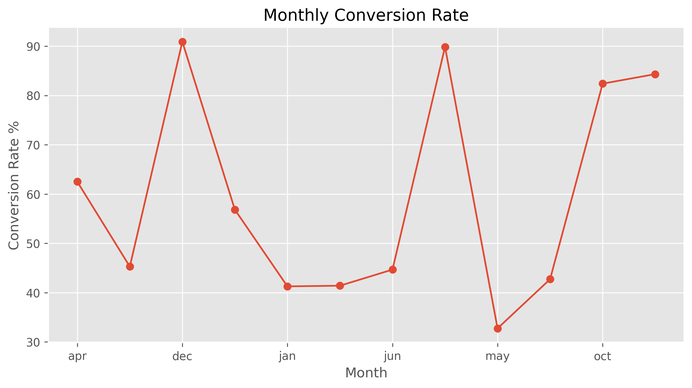
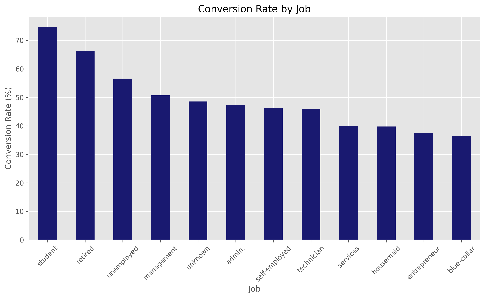
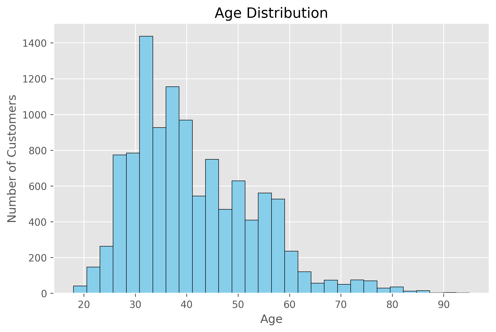
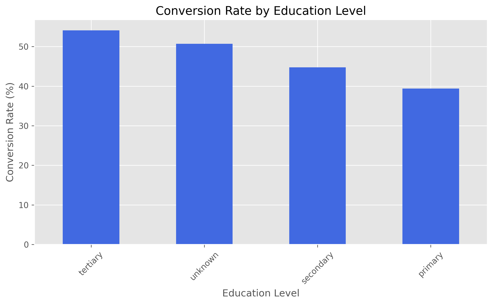
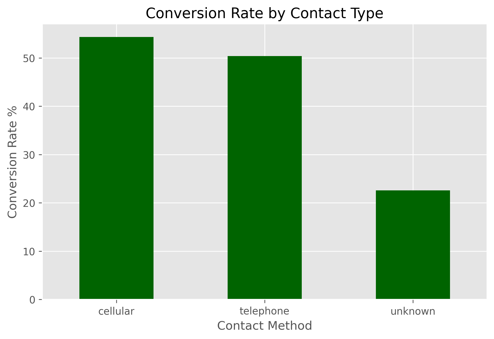
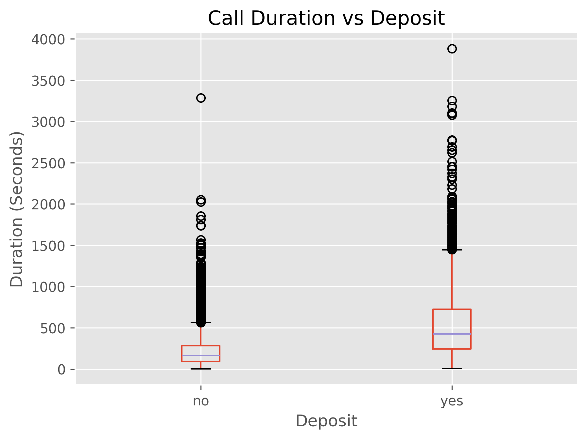
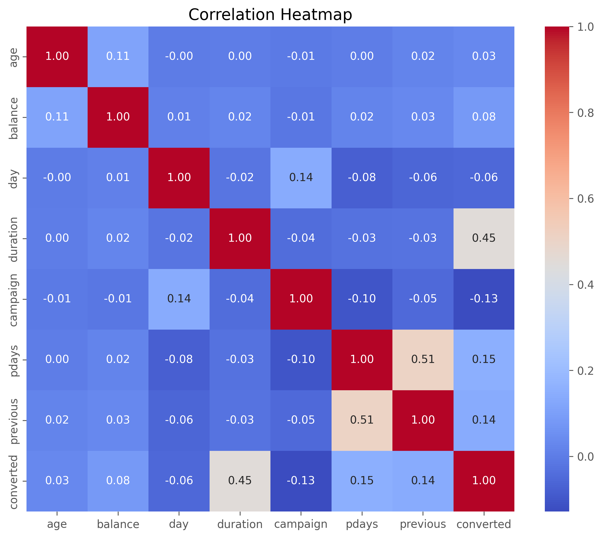

# 📈 Marketing Campaign Analytics

An end-to-end **Marketing Campaign Analytics** project that analyzes customer behavior, campaign effectiveness, and conversion performance using **Python, SQL, Power BI, and Data Analytics** techniques.

The objective of this project is to transform raw marketing campaign data into actionable business insights that help organizations improve customer targeting, optimize campaign performance, and increase conversion rates.

---

# 📌 Project Overview

Marketing campaigns generate large volumes of customer interaction data. Understanding which customer segments respond positively to campaigns enables businesses to allocate marketing budgets more efficiently and maximize return on investment (ROI).

In this project, the dataset was cleaned, explored, analyzed, and visualized to identify the major factors influencing customer subscription to marketing campaigns.

---

# 🎯 Objectives

- Analyze customer demographics
- Identify factors affecting campaign success
- Study customer conversion behavior
- Analyze campaign performance
- Evaluate marketing funnel performance
- Discover patterns that improve future marketing strategies
- Build an interactive Power BI dashboard for business decision-making

---

# 🛠️ Tech Stack

- Python
- Pandas
- NumPy
- Matplotlib
- Seaborn
- SQL
- Power BI
- Jupyter Notebook

---

# 📂 Repository Structure

```text
Marketing-Campaign-Analytics
│
├── .gitattributes
│
├── 01Dataset
│   ├── bank.csv
│   └── kpi_metrics.csv
│
├── 02Notebook
│   ├── Marketing_Funnel_Analysis.ipynb
│   ├── Final_Marketting_Data.csv
│   ├── Marketing_Funnel.csv
│   ├── Job_Conversion.csv
│   └── Month_Conversion.csv
│
├── 03Images
│   ├── account_balance_distribution.png
│   ├── age_distribution.png
│   ├── average_balance_by_deposit.png
│   ├── call_duration_distribution.png
│   ├── call_duration_vs_deposit.png
│   ├── campaign_contacts_conversion_rate.png
│   ├── contact_conversion_rate.png
│   ├── contact_method_distribution.png
│   ├── correlation_heatmap.png
│   ├── deposit_distribution.png
│   ├── deposit_subscription.png
│   ├── education_conversion_rate.png
│   ├── housing_conversion_rate.png
│   ├── job_conversion_rate.png
│   ├── job_distribution.png
│   ├── marital_conversion_rate.png
│   ├── marketing_funnel.png
│   ├── monthly_conversion_rate.png
│   ├── personal_loan_conversion_rate.png
│   └── previous_outcome_conversion_rate.png
│
├── Bank Marketing Dashboard.pbix
├── Marketing_Campaign_Analytics_Report.pdf
└── README.md
```
---

# 🔄 Project Workflow

```text
Raw Dataset
      │
      ▼
Data Cleaning
      │
      ▼
Exploratory Data Analysis (EDA)
      │
      ▼
Feature Engineering
      │
      ▼
Marketing Funnel Analysis
      │
      ▼
Business Insights
      │
      ▼
Power BI Dashboard
```

---

# ⚙️ How This Project Was Built

## Step 1 — Data Collection

The Bank Marketing dataset containing customer demographics, campaign information, and subscription details was collected for analysis.

---

## Step 2 — Data Cleaning

The dataset was cleaned using Python by:

- Handling missing values
- Removing duplicate records
- Correcting inconsistent values
- Formatting data types
- Preparing the data for analysis

---
# 📊 Dashboard & Analysis Preview

## Power BI Dashboard

<p align="center">
  
</p>

---

## Step 3 — Exploratory Data Analysis (EDA)

## Customer Conversion Analysis

<p align="center">
  
  
</p>

---

## Customer Demographics

<p align="center">
  
  
</p>

---

## Campaign Performance

<p align="center">
  
  
</p>

---

## Feature Correlation

<p align="center">
  
</p>
-----

# 📈 Key Insights

- Customer occupation significantly influences campaign conversion.
- Previous successful campaign interactions increase the likelihood of future subscriptions.
- Contact method impacts campaign effectiveness.
- Longer customer interactions generally lead to higher conversion rates.
- Education level plays an important role in customer response.
- Certain months consistently achieve better conversion performance.
- Campaign efficiency varies across different customer segments.

---

# 📌 Business Questions Answered

- Which customer segments convert the most?
- Which job categories have the highest subscription rate?
- Does account balance influence customer decisions?
- Which communication method performs best?
- How does campaign duration affect conversions?
- Which months generate the highest campaign success?
- What customer characteristics are associated with successful subscriptions?

---

# 💼 Power BI Dashboard

The interactive dashboard includes:

- Overall Campaign KPIs
- Customer Conversion Analysis
- Marketing Funnel
- Monthly Performance
- Customer Demographics
- Campaign Effectiveness
- Conversion Trends
- Interactive Filters and Slicers

---

# 🚀 How to View This Project

## 1️⃣ Explore the Dataset

Open:

```text
01Dataset/bank.csv
```

to view the original dataset.

---

## 2️⃣ View the Jupyter Notebook

Open:

```text
02Notebook/Marketing_Funnel_Analysis.ipynb
```

to see the complete data cleaning, exploratory data analysis, feature engineering, and marketing funnel analysis performed in Python.

---

## 3️⃣ Open the Power BI Dashboard

Open:

```text
Bank Marketing Dashboard.pbix
```

using **Microsoft Power BI Desktop** to explore the interactive dashboard.

---

## 4️⃣ Read the Project Report

Open:

```text
Marketing_Campaign_Analytics_Report.pdf
```

for a detailed explanation of the methodology, analysis, visualizations, and business insights.

---

# 💡 Skills Demonstrated

- Data Cleaning
- Exploratory Data Analysis (EDA)
- Marketing Analytics
- Customer Segmentation
- Marketing Funnel Analysis
- Data Visualization
- Business Intelligence
- Power BI Dashboard Development
- Python Programming
- SQL
- Business Insights Generation

---

# 📷 Project Visualizations

The repository includes multiple analytical visualizations, including:

- Age Distribution
- Job Distribution
- Contact Method Distribution
- Campaign Contact Analysis
- Monthly Conversion Rate
- Marketing Funnel
- Job Conversion Rate
- Education Conversion Rate
- Housing Loan Conversion
- Personal Loan Conversion
- Deposit Distribution
- Correlation Heatmap
- Account Balance Analysis
- Call Duration Analysis
- Previous Campaign Outcome Analysis

These visualizations help explain customer behavior and campaign performance through clear and interactive analysis.

---

# 👩‍💻 About Me

## Shruti Prasad

**B.Tech in Artificial Intelligence & Data Science**

**Gati Shakti Vishwavidyalaya**

Vadodara, Gujarat, India

I am passionate about **Data Analytics, Machine Learning, Business Intelligence, and AI-driven solutions.** I enjoy building end-to-end data projects that combine **Python, SQL, Power BI, and machine learning** to solve real-world business problems.

---

# 🤝 Connect with Me

- 💼 **LinkedIn:** https://www.linkedin.com/in/shruti-prasad-35123636b/
- 💻 **GitHub:** https://github.com/shruti08-31

---

# ⭐ Support

If you found this project useful or have any suggestions, feel free to connect with me or open an issue in this repository.

If you like this project, consider giving it a ⭐ on GitHub!
